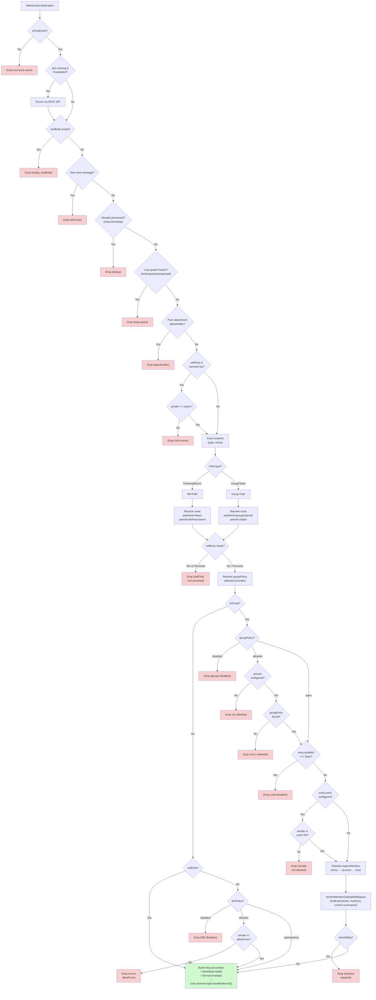

# RingCentral Channel — Message Processing Flowchart

```mermaid
flowchart TD
    WS["WebSocket Notification"] --> IS_POST{"isPostEvent?"}
    IS_POST -- No --> DROP_EVENT["Drop (non-post event)"]
    IS_POST -- Yes --> ENRICH{"text missing &\nPostAdded?"}
    ENRICH -- Yes --> REST_ENRICH["Enrich via REST API"]
    REST_ENRICH --> CHECK_BODY
    ENRICH -- No --> CHECK_BODY

    CHECK_BODY{"rawBody empty?"}
    CHECK_BODY -- Yes --> DROP_EMPTY["Drop (empty_rawBody)"]
    CHECK_BODY -- No --> OWN_MSG{"Own sent message?"}

    OWN_MSG -- Yes --> DROP_OWN["Drop (self-loop)"]
    OWN_MSG -- No --> DEDUP{"Already processed?\n(inbound dedup)"}

    DEDUP -- Yes --> DROP_DEDUP["Drop (dedup)"]
    DEDUP -- No --> LOOP_GUARD{"Loop guard marker?\n(thinking/answer/queued)"}

    LOOP_GUARD -- Yes --> DROP_LOOP["Drop (loop guard)"]
    LOOP_GUARD -- No --> ATTACH_PLACEHOLDER{"Pure attachment\nplaceholder?"}

    ATTACH_PLACEHOLDER -- Yes --> DROP_ATTACH["Drop (placeholder)"]
    ATTACH_PLACEHOLDER -- No --> SELF_ONLY_OWNER{"selfOnly &\nownerId set?"}

    SELF_ONLY_OWNER -- Yes --> SENDER_IS_OWNER{"sender == owner?"}
    SENDER_IS_OWNER -- No --> DROP_NON_OWNER["Drop (non-owner)"]
    SENDER_IS_OWNER -- Yes --> CHAT_INFO
    SELF_ONLY_OWNER -- No --> CHAT_INFO

    CHAT_INFO["Fetch chatInfo\n(type, name)"] --> CLASSIFY{"Chat type?"}

    CLASSIFY -- "Personal/Direct" --> DM_PATH["DM Path"]
    CLASSIFY -- "Group/Team" --> GROUP_PATH["Group Path"]

    %% ─── Routing (shared) ───
    DM_PATH --> ROUTE_DM["Resolve route\npeerKind=direct\npeerId=dmPeerUserId"]
    GROUP_PATH --> ROUTE_GRP["Resolve route\npeerKind=group|channel\npeerId=chatId"]

    ROUTE_DM --> SELF_ONLY_MODE{"selfOnly mode?"}
    ROUTE_GRP --> SELF_ONLY_MODE

    SELF_ONLY_MODE -- "Yes & !Personal" --> DROP_SELF_ONLY["Drop (selfOnly,\nnon-personal)"]
    SELF_ONLY_MODE -- No / Personal --> RESOLVE_POLICY["Resolve groupPolicy\n(allowlist provider)"]

    %% ─── Group Policy ───
    RESOLVE_POLICY --> IS_GROUP_2{"isGroup?"}
    IS_GROUP_2 -- No --> DM_POLICY
    IS_GROUP_2 -- Yes --> GP_CHECK{"groupPolicy?"}

    GP_CHECK -- disabled --> DROP_GP_DISABLED["Drop (groups disabled)"]
    GP_CHECK -- allowlist --> AL_CONFIGURED{"groups\nconfigured?"}
    GP_CHECK -- open --> ENABLED_CHECK

    AL_CONFIGURED -- No --> DROP_AL_EMPTY["Drop (no allowlist)"]
    AL_CONFIGURED -- Yes --> IN_ALLOWLIST{"groupEntry\nfound?"}
    IN_ALLOWLIST -- No --> DROP_AL_MISS["Drop (not in allowlist)"]
    IN_ALLOWLIST -- Yes --> ENABLED_CHECK

    ENABLED_CHECK{"entry.enabled\n=== false?"} -- Yes --> DROP_DISABLED["Drop (chat disabled)"]
    ENABLED_CHECK -- No --> USER_CHECK{"entry.users\nconfigured?"}

    USER_CHECK -- Yes --> SENDER_ALLOWED{"sender in\nusers list?"}
    SENDER_ALLOWED -- No --> DROP_SENDER["Drop (sender\nnot allowed)"]
    SENDER_ALLOWED -- Yes --> MENTION_GATE
    USER_CHECK -- No --> MENTION_GATE

    %% ─── Mention Gating (Group only) ───
    MENTION_GATE["Resolve requireMention\n(entry → account → true)"]
    MENTION_GATE --> MENTION_RESOLVE["resolveMentionGatingWithBypass\n(botExtensionId, mentions,\ncontrol commands)"]
    MENTION_RESOLVE --> SHOULD_SKIP{"shouldSkip?"}
    SHOULD_SKIP -- Yes --> DROP_MENTION["Drop (mention\nrequired)"]
    SHOULD_SKIP -- No --> DELIVER

    %% ─── DM Policy ───
    DM_POLICY{"selfOnly?"}
    DM_POLICY -- Yes --> DELIVER
    DM_POLICY -- No --> DM_POLICY_CHECK{"dmPolicy?"}

    DM_POLICY_CHECK -- disabled --> DROP_DM_DISABLED["Drop (DM disabled)"]
    DM_POLICY_CHECK -- allowlist --> DM_ALLOW{"sender in\nallowFrom?"}
    DM_ALLOW -- No --> DROP_DM_DENY["Drop (not in\nallowFrom)"]
    DM_ALLOW -- Yes --> DELIVER
    DM_POLICY_CHECK -- "open/pairing" --> DELIVER

    %% ─── Deliver ───
    DELIVER["Build inbound context\n+ download media\n+ format envelope\n→ core.channel.reply.handleInbound()"]

    style DROP_EVENT fill:#f9d0d0
    style DROP_EMPTY fill:#f9d0d0
    style DROP_OWN fill:#f9d0d0
    style DROP_DEDUP fill:#f9d0d0
    style DROP_LOOP fill:#f9d0d0
    style DROP_ATTACH fill:#f9d0d0
    style DROP_NON_OWNER fill:#f9d0d0
    style DROP_SELF_ONLY fill:#f9d0d0
    style DROP_GP_DISABLED fill:#f9d0d0
    style DROP_AL_EMPTY fill:#f9d0d0
    style DROP_AL_MISS fill:#f9d0d0
    style DROP_DISABLED fill:#f9d0d0
    style DROP_SENDER fill:#f9d0d0
    style DROP_MENTION fill:#f9d0d0
    style DROP_DM_DISABLED fill:#f9d0d0
    style DROP_DM_DENY fill:#f9d0d0
    style DELIVER fill:#d0f9d0
```
